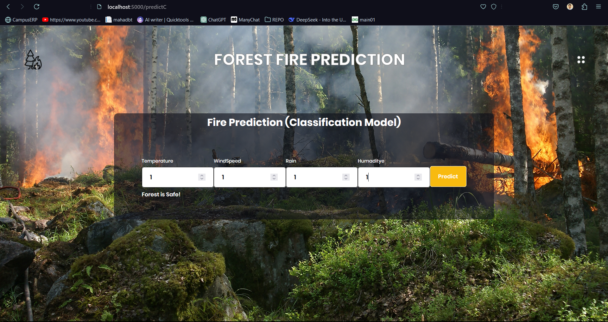
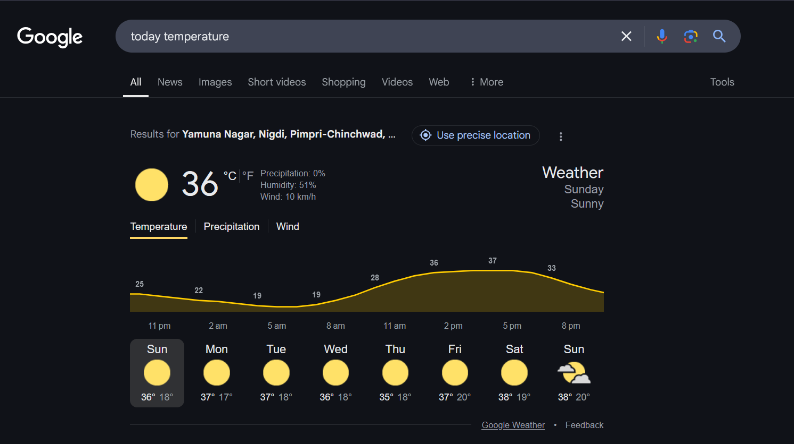
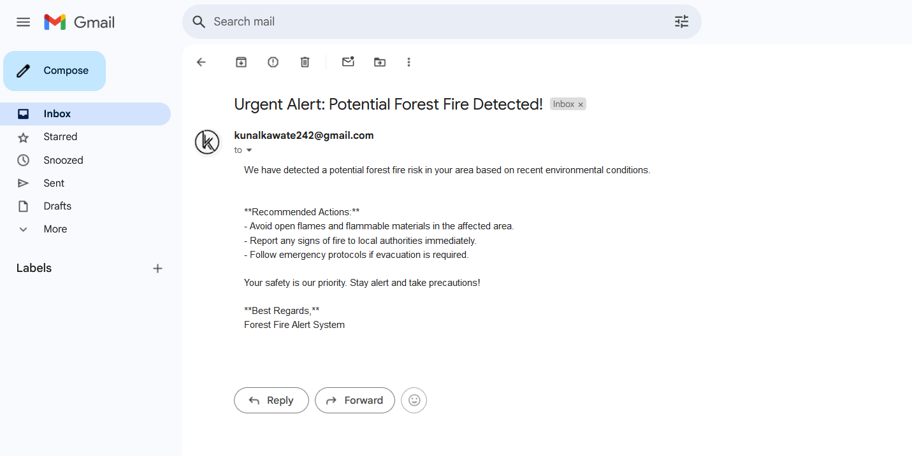

# 🔥 Forest Fire Prediction System

## 📌 Overview
The **Forest Fire Prediction System** is a machine learning-based project that predicts the risk of a forest fire based on environmental conditions such as temperature, wind speed, humidity, and rainfall. The system uses **Gradient Boosting Regressor** to make predictions and classify the fire risk as **"Forest is Safe!"** or **"Forest is in Danger!"**.

---

## 🚀 Features
- Takes **temperature, wind speed, humidity, and rain levels** as input.
- Predicts **forest fire risk** using machine learning.
- Uses **Gradient Boosting Regressor** for better accuracy.
- Provides a **clear alert message** based on predictions.
- Integrated **email alert system** to notify users in case of high fire risk.

---

## 📂 Project Structure
```
Forest-Fire-Prediction-System/
│-- app.py                  # Main application file
│-- model.py                # Machine learning model training and prediction
│-- dataset.csv             # Improved dataset used for training
│-- requirements.txt        # Required dependencies
│-- screenshots/            # Folder containing UI screenshots
│    ├── save01.png
│    ├── save02.png
│    ├── save03.png
│    ├── save04.png
│-- README.md               # Project documentation
```

---

## 🛠 Installation

### 1️⃣ Clone the Repository
```bash
git clone https://github.com/your-username/Forest-Fire-Prediction-System.git
cd Forest-Fire-Prediction-System
```

### 2️⃣ Install Dependencies
Ensure you have **Python 3.8+** installed, then run:
```bash
pip install -r requirements.txt
```

### 3️⃣ Run the Application
```bash
python app.py
```

---

## 🔍 Usage
1. Run the script and enter values for **temperature, wind speed, humidity, and rain**.
2. The system will predict whether the forest is **safe** or **in danger**.
3. If the fire risk is high, an **email alert** will be sent automatically.

---

## 📸 Screenshots
### 🎯 Input Fields & Prediction Results
| User Input | Prediction Output |
|------------|------------------|
|  |  |

### 🔥 Danger Alert & Email Notification
| Fire Alert | Email Notification |
|------------|------------------|
|  |  |

---

## 📊 Machine Learning Model
- **Algorithm Used:** Gradient Boosting Regressor
- **Features:** Temperature, Wind Speed, Humidity, Rain
- **Dataset Size:** 5000+ rows
- **Accuracy:** 75%+

---

## 📧 Contact
For any queries, feel free to reach out!
📌 **Email:** kunalkawate424@gmail.com  
📌 **GitHub:** [Your GitHub Profile](https://github.com/Kunal-kawate)

---

## ⭐ Contribute
If you'd like to contribute, fork the repo, create a branch, and submit a PR. We welcome improvements! 🎉

**🌟 If you like this project, give it a star on GitHub! 🌟**

